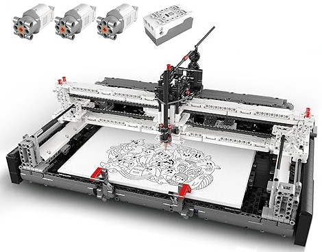

# Reverse engineered bluetooth messages for MKH4.0 Module from Mould King

This document is work in progress and covers the current knowledge of the protocol of the
MKH4.0 module built by Mould King.

These modules ship with the 2D Plotter set, which contains one MKH4.0 module and 3 LH motors.



## Demo application

A demo application written in TypeScript for NodeJS (tested version 21.7.3) can be used to test the commands:

Install: `npm install`

Run: `npm start`

This starts the test program in `src/test-mould-king.ts`

## Brief summary general protocol

- Scan and connect to uuid `0xaf30`
- Discover service `0xae3a` and characteristic `0xae3b` (write no response) and characteristic `0xae3c` (notify).
- Some (but not all) messages result in notifications sent through the notify characteristic.
- The messages sent through the write characteristic always start with a `T`, a 3 digit hex message identifier,
  the payload and ends with a `W`, e.g. `T12AABCDW`, where 12A is the message identifier and `ABCD` is the payload
- The maximum packet length is always 20. If the message is longer distribute the message over multiple packets,
  e.g. the message is `T123ABCDABCDABCDABCDABCW`, then send two packets `T123ABCDABCDABCDABCD` and `ABCW`
- The response received through the notify characteristic uses the same message syntax
- All message characters are always uppercase

## Status/Heartbeat

Get the status of connected motors.

Message: `T00CW`

Received notifications:

`T027C0XW` where X is the motor bitmask represented as a single hex digit. In the
bitmask a ` 1`` represents a not connected motor port and  `0` represents a connected
port.

Examples:

- No motor attached: Bitmask 1111 => represented as single hex digit `F` => T027C0FW
- Motor A attached: Bitmask 1110 => hex `E` => `T027C0EW`
- Motor B attached: Bitmask 1101 => hex `D` => `T027C0DW`
- Motor C attached: Bitmask 1011 => hex `B` => `T027C0BW`
- Motor D attached: Bitmask 0111 => hex `7` => `T027C07W`

## Simple motor start

Message: `T144 0XXXX 0XXXX 0XXXX 0XXXX W` (added white spaces for readability)

The message contains 4 parts for each motor speed. Sending `T14400000000000000000000W` turns
all motors off.

The minimum speed is 0.
The maximum speed is `0x7fff`.
To control the turn direction you have to add `0x8000` to the speed when you want
to turn the motor left.

Examples:
Sending `T1440FFFF0FFFF0FFFF0FFFFW` turns motor with full speed (left turn).
Sending `T1440FFFF0FFFF0FFFF0FFFFW` turns motor with full speed (left turn).

## Motor with position and speed

The MKH motors are step motors where you can set
the target position and speed to drive them.

Example:
`T303 0148 01790B70 8000 00000000 8000 00000000 8000 00000000 W` (added white spaces for readability)

Message data:

```
Message start             [1] "T"
Command for Position turn [3] "303"
Motor A
Turn direction and speed  [4] Speed (0x0 - 0x7fff) added with 0x8000 based on
                              sign of target position.
Position target           [8] Can be the negative or posive target position.
                              If the target position is positive add the
                              speed  with 0x8000 and use only the absolute target position here without sign.
Motor B
Turn direction and speed  [4] see Motor A
Position target           [8] see Motor A
Motor C
Turn direction and speed  [4] see Motor A
Position target           [8] see Motor A
Motor D
Turn direction and speed  [4] see Motor A
Position target           [8] see Motor A
Message end               [1] "W"
```

## Get current motor position

The command reports the current motor position.

Message: `T02AXXW` where XX is the motor bitmask in two digit hex.

Example:

- Motor A, bitmask 0001 => hex `01` => T02A01W
- Motor D, bitmask 1000 => hex `08` => T02A08W

This notifications are received when the command T02AXXW was sent:

`T0A7 AX +01790802 W` (white spaces added for readability)

where X is the one digit hex value of the motor:

- Motor A => `1`
- Motor B => `2`
- Motor C => `3`
- Motor D => `4`

In the above example +01790802 is the current motor position in
hex which is signed and can also have a trailing `-` sign.

Notes:

- The bitmask in the message allows to ask for the current position of
  multiple motors. In this case you receive multiple response messages.
- If a limit was set it also send the limits (to be verified):
  `T487B+01790B70-01790B70+00989680+00000000+00989680+00000000+00989680+00000000W`

## Motor position reached

This notification is received when the motors reach their target positions

`T027300W`

## Reset motor position

Resets the motor position to position `0`.

Message: `T028XXW`

where XX is the motor bitmask in two digit hex.

Example:

- Motor A => bitmask `0001` => hex `01`
- Motor B => bitmask `0010` => hex `02`
- Motor C => bitmask `0100` => hex `04`
- Motor D => bitmask `1000` => hex `08`

## Set position limits

You can persist position limits in the controller. These have no effect
for driving the motor: You can drive outside of the limits.

Message `T149 XX +XXXXXXXX -XXXXXXXX W` (white spaces added for readability)

Message data:

```
Message start             [1] "T"
Message type              [3] "149"
Positive limit sign       [1] "+"
Positive limit            [8] Set the positive limit (0x0 - 0xffffffff)
Negative limit sign       [1] "-"
Negative limit            [8] Set the negative limit (0x0 - 0xffffffff)
Message end               [1] "W"
```

## Read position limits

It is possible to read the position limits.

Todo.

## MKH4.0 Initialization

These messages are sent during initialization.
It is currently why they are sent and if this is required.

- `T041AABBW`
- `T00EW`
- `T01F1W`

One response of those commands is the received message `T01711W` which can be used
as a "ready" event.
